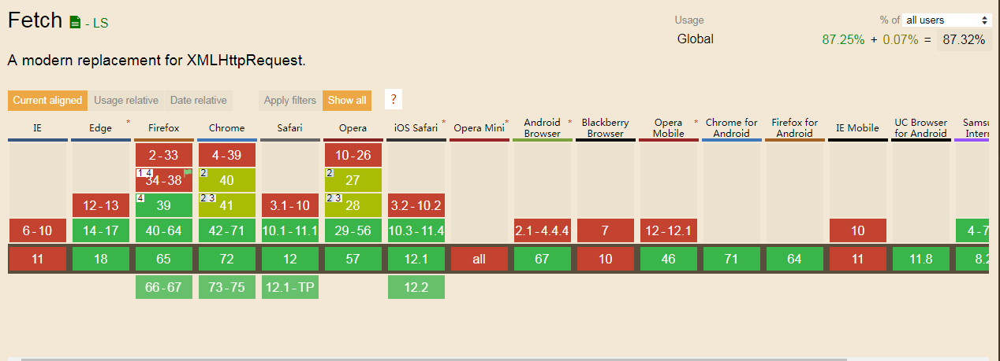

# something-about-Fetch-API
## 1.Fetch API
   
   ajax是对于XMLHttpRequest的一种封装，Fetch API是XMLHttpRequest的最新替代技术，它是W3C的正式标准。Fetch 是一个现代的概念, 等同于 XMLHttpRequest。它提供了许多与XMLHttpRequest相同的功能，但被设计成更具可扩展性和高效性。
 

    各浏览器对于fetch的支持情况
 

