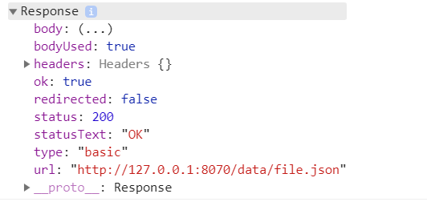

# something-about-Fetch-API
## 1.Fetch API
   
&nbsp;&nbsp;&nbsp;&nbsp;ajax是对于XMLHttpRequest的一种封装，Fetch API是XMLHttpRequest的最新替代技术，它是W3C的正式标准。Fetch 是一个现代的概念, 等同于 XMLHttpRequest。它提供了许多与XMLHttpRequest相同的功能，但被设计成更具可扩展性和高效性。
<br/><br/>

&nbsp;&nbsp;&nbsp;&nbsp;各浏览器对于fetch的支持情况：
   


<br/><br/>
&nbsp;&nbsp;&nbsp;&nbsp;pc端主流浏览器支持良好，对于无法支持的IE，目前已经有npm包实现兼容处理：[A window.fetch JavaScript polyfill](http://jianshu.com)

<br/><br/>

## 2.使用
&nbsp;&nbsp;&nbsp;&nbsp;目前为止的项目都是直接使用ajax，fetch是直接基于promise实现，Fetch API提供了一个fetch()方法， 上手也很简单。

+ 获取数据
```
 fetch('./data/file.json')
    .then(response => {
        console.log(response.headers); //Headers对象
        console.log(response.headers.get('Content-Type')); //application/json; charset=UTF-8
        console.log(response.headers.get('Date')); //Thu, 14 Mar 2019 05:58:20 GMT
        console.log(response.status); //200
        console.log(response.statusText); //OK
        console.log(response.url); //http://127.0.0.1:8070/data/file.json
        return response.json() 
    })
    .then(data => {
        console.log(data); //{state: "ok", msg: "ok", data: "返回了文本"}
    })

```

&nbsp;&nbsp;&nbsp;&nbsp;需要注意的是fetch返回的是一个response对象。

   


&nbsp;&nbsp;&nbsp;&nbsp;事实上，当fetch接收到url参数后会立即返回一个Promise, 当Promise通过后会返回response对象（包括请求时可以使用的request对象，都遵循HTTP标准），打印response发现请求的结果数据并不在其中，因为所请求回来的数据都存储在body中，作为一种可读的流。此时需要恰当的方法将可读的流转为能够使用的数据，对于我所模拟的json数据，调用 response.json()即可。如果请求一个XML格式文件，则调用response.text()。如果请求图片，使用response.blob方法()。还要一些其他类型，都有对应的方法，并都返回一个promise对象，这样可以继续调用.then()方法处理转换后的数据。
<br/>

+ 发送数据
<br/>
&nbsp;&nbsp;&nbsp;&nbsp;使用fetch发送数据，可以通过new Request() API 创建。
<br/> 

```
   const request = new Request('./file.json', {
            method: 'get', 
            cache: 'reload',
            headers: new Headers({
              'Content-Type': 'application/json' //一般使用JSON数据格式，所以设置ContentType为application/json。
            })
  })
  fetch(request)
```
或
```
  let content = {some: 'content'};
  fetch('some-url', {
      method: 'post',
      headers: {
        'Content-Type': 'application/json'
      },
      body: JSON.stringify(content)
  })
```

<br/>

&nbsp;&nbsp;&nbsp;&nbsp;由于fetch使用reponse和request对象，相较于传统的XMLHttpRequest, 它能够明确的配置请求对象以及获取响应对象头的数据。
<br/><br/>

## 3.缺陷
&nbsp;&nbsp;&nbsp;&nbsp;Fetch 现在还没有方法中止一个请求。而且用 Fetch 不能监测上传进度（XMLHttpRequest对象，传送数据的时候，有一个progress事件，用来返回进度信息）。目前可以使用AbortController 和 AbortSignal，这个通用的API 来通知中止事件。


